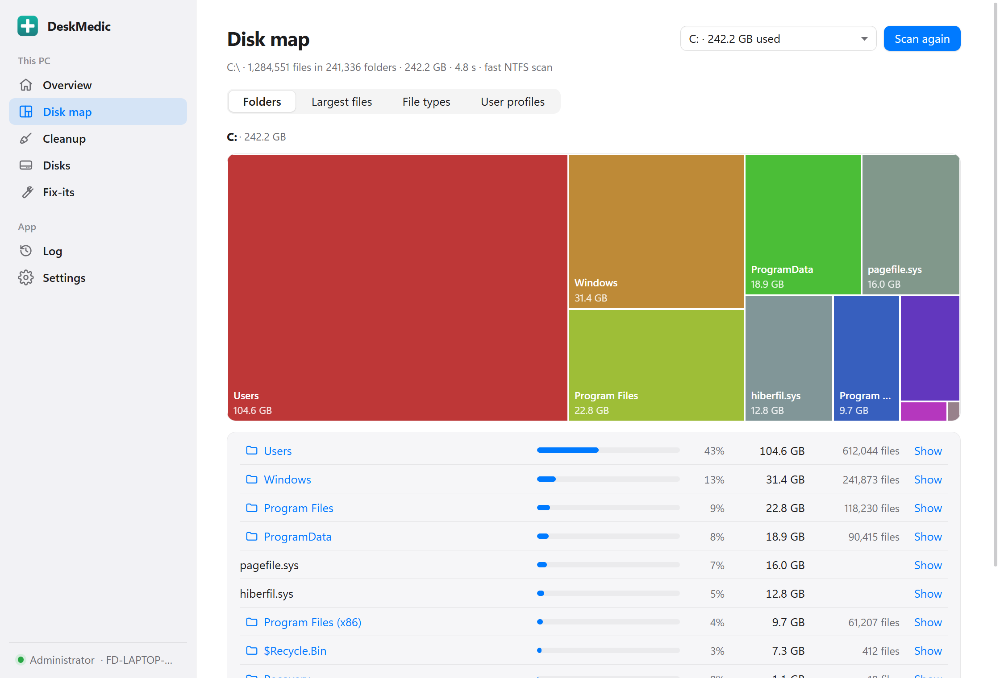
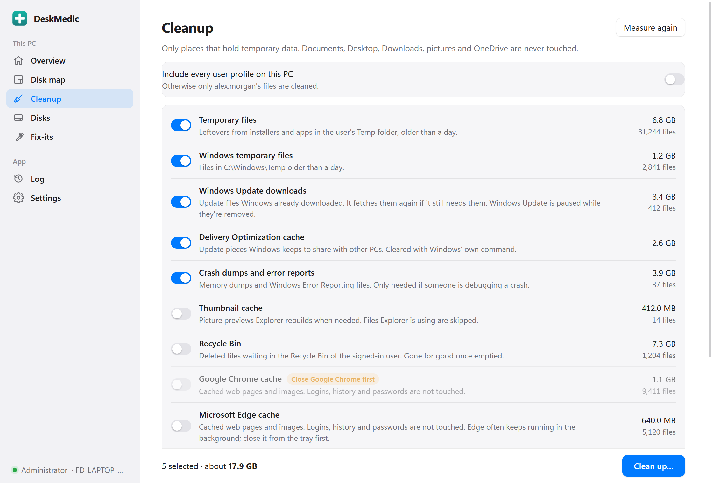
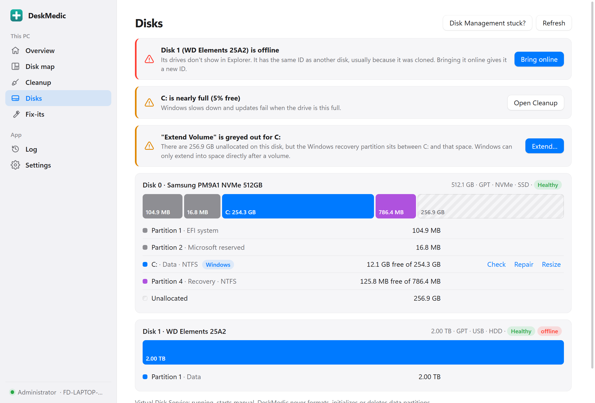
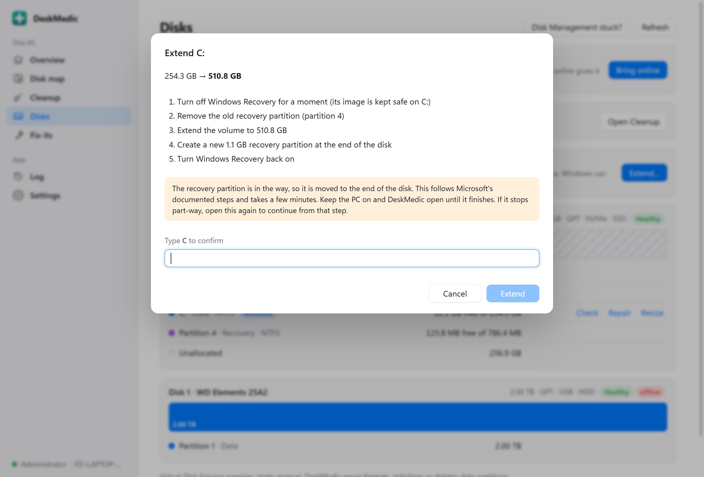
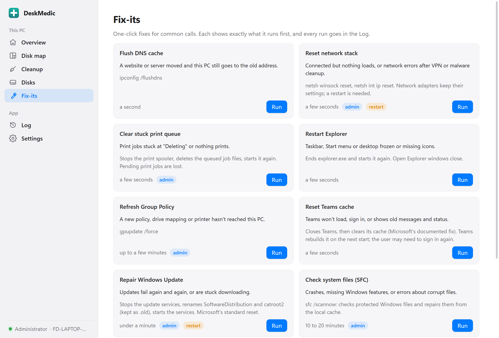
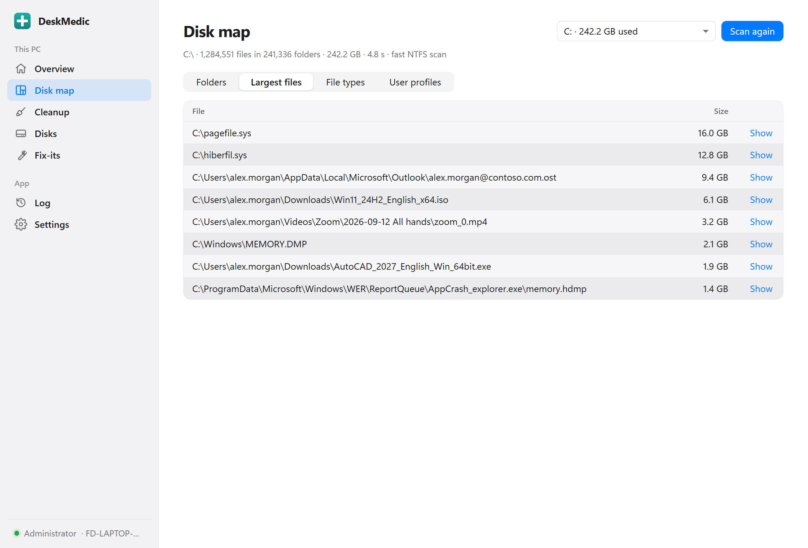
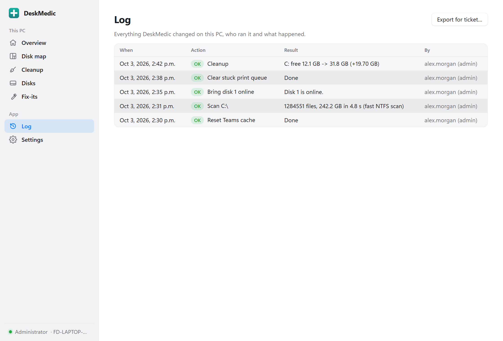

# DeskMedic

A portable Windows toolkit for helpdesk technicians: see what fills a disk, clear temporary files safely, fix common Disk Management problems, and run one-click fixes for everyday calls.
<br clear="left">

- **Portable.** One small `.exe`, no install. Run it from a USB stick or a network share; nothing is written next to it.
- **Safe by design.** Everything that changes something is shown first, and every change goes in a log you can paste into a ticket. Documents, Desktop, Downloads, pictures and OneDrive are never touched. It never formats, initializes or deletes data partitions.
- **Offline and private.** No account, no cloud, no telemetry. It only goes online when you click "Check for a newer version".



| Cleanup | Disks | Extend Volume greyed out? |
|---|---|---|
|  |  |  |

| Fix-its | Largest files | Log for the ticket |
|---|---|---|
|  |  |  |

<sub>Screenshots use a made-up demo PC.</sub>

## Features

| | |
|---|---|
| **Disk map** | Scan a drive and see which folders and files take the space: a treemap you can click into, folder sizes, the largest files, totals by file type, and user profiles (oldest first) with their sizes. As administrator, NTFS drives are read straight from the master file table, like WizTree: a whole drive in seconds. Without admin rights it walks folder by folder. |
| **Cleanup** | Measures first, then clears temp files, Windows Update downloads, the Delivery Optimization cache, crash dumps, the thumbnail cache, the Recycle Bin, browser caches, the Teams cache, Outlook's temporary attachments, and old Windows components (DISM). Shows the drive's free space before and after. |
| **Disks** | Every disk drawn like Disk Management, with plain-English findings and a fix for each: offline disks (including cloned disks), read-only disks and partitions, volumes without a drive letter, file-system errors, nearly full drives, failing drives, and a stuck or disabled Virtual Disk Service. |
| **Extend / shrink** | Resize a data partition within the limits Windows reports. Fixes the classic *Extend Volume is greyed out* case where the recovery partition sits between C: and the free space. |
| **Fix-its** | Ten one-click fixes for common calls: DNS, network stack, print queue, Explorer, Group Policy, Teams, Windows Update, SFC, DISM, clock. |
| **Log** | Who ran what, on which PC, with what result. **Export for ticket** saves it as plain text. |

## Download and run

1. Download `DeskMedic-x.y.z.exe` from [Releases](../../releases). Check it if you like: `Get-FileHash .\DeskMedic-x.y.z.exe` should match the SHA-256 on the release page.
2. Run it. It offers **Restart as administrator**; most fixes need that.

Needs Windows 10 or 11 with the Microsoft Edge WebView2 runtime (built into Windows 11 and up-to-date Windows 10).

**The exe is not code-signed yet.** SmartScreen says "Windows protected your PC": choose **More info → Run anyway**. Some antivirus products are wary of unsigned tools that delete files; compare the SHA-256 if yours complains.

### With and without administrator rights

| Works as a standard user | Needs administrator |
|---|---|
| Disk map (folder-by-folder scan) | Fast NTFS scan, and folders the user can't open |
| Cleanup of the user's own temp files, crash dumps, thumbnails, Recycle Bin, browser, Teams and Outlook caches | Windows temp, Windows Update, Delivery Optimization, system crash dumps, component cleanup, other users' profiles |
| Looking at disks and findings | Every disk change |
| Flush DNS, restart Explorer, reset Teams | All other fix-its |

## Getting started

**"My C: drive is full."** Open **Disk map**, pick C: and press **Scan**. Click the big blocks to drill in, check **Largest files** and **User profiles** (old profiles on shared PCs are a common culprit). Then go to **Cleanup**, look at the measured sizes, untick anything you want to keep, and press **Clean up…**. The result shows how much free space you gained.

**"My drive is missing" or "Disk Management won't load."** Open **Disks**. Problems are listed at the top with the likely cause and a fix button. Every change asks you to type the disk number or drive letter to confirm.

**"C: is out of space but the disk is bigger."** Open **Disks**. If there is unallocated space, DeskMedic says whether C: can be extended directly, or whether the recovery partition is in the way, and offers **Extend…**.

**For the ticket.** Open **Log** and press **Export for ticket**.

## What Cleanup removes

Only these places. Each is measured before anything is deleted, and files in use are skipped.

| Category | Where | Admin | Notes |
|---|---|---|---|
| Temporary files | `%LOCALAPPDATA%\Temp` | | Older than a day. As admin, optionally for every profile on the PC. |
| Windows temporary files | `C:\Windows\Temp` | ✓ | Older than a day. |
| Windows Update downloads | `C:\Windows\SoftwareDistribution\Download` | ✓ | Windows Update and BITS are paused while files are removed, then started again. |
| Delivery Optimization cache | Windows' own `Delete-DeliveryOptimizationCache` | ✓ | |
| Crash dumps and error reports | `%LOCALAPPDATA%\CrashDumps`, Windows Error Reporting queues; as admin also `C:\Windows\Minidump`, `MEMORY.DMP`, `LiveKernelReports\*.dmp` | | |
| Thumbnail cache | `thumbcache_*.db` in `%LOCALAPPDATA%\Microsoft\Windows\Explorer` | | Not ticked by default. |
| Recycle Bin | The signed-in user's bin on all drives | | Not ticked by default. |
| Chrome / Edge cache | `Cache`, `Code Cache`, `GPUCache` and shader caches of each browser profile | | Skipped while the browser is open. Logins, history and passwords are never touched. |
| Firefox cache | `cache2` of each Firefox profile | | Skipped while Firefox is open. |
| Microsoft Teams cache | New Teams: `Packages\MSTeams_8wekyb3d8bbwe\LocalCache\Microsoft\MSTeams`; classic Teams cache folders | | Skipped while Teams is open. Microsoft's documented fix for Teams problems. |
| Outlook temporary attachments | `INetCache\Content.Outlook` | | Skipped while Outlook is open. |
| Windows component cleanup | `DISM /Online /Cleanup-Image /StartComponentCleanup` | ✓ | Takes several minutes. |

## Disk problems it recognises

| Finding | Likely cause | Fix offered |
|---|---|---|
| Disk is offline | New or moved disk kept offline by the storage policy; a cloned disk with the same ID as another | Bring online (gives a cloned disk a new ID) |
| Disk or partition is read-only | Left over from a policy or a failed copy; sometimes a failing disk | Make writable |
| Volume has no drive letter | Letter clash, often with a network drive | Give it the next free letter |
| Volume reports file-system problems | Unsafe removal, power loss | Check (read-only scan), then Repair. The Windows drive is checked at the next restart. |
| Drive nearly full | | Open Cleanup |
| Disk not healthy | The drive itself warns of failure | Back up and replace (no fix, on purpose) |
| Disk not initialized | New, empty disk | Pointer to Disk Management (initializing can erase data) |
| Virtual Disk Service disabled, or Disk Management stuck "connecting" | Service disabled by a script or tweak tool; a hung service | Turn it back on / restart it |
| *Extend Volume* greyed out | The recovery partition (or another partition) sits between the volume and the free space | Guided extend (below) |

### The *Extend Volume is greyed out* fix

Common after growing a virtual machine's disk or cloning to a bigger drive. DeskMedic follows Microsoft's documented WinRE steps:

1. Turn off Windows Recovery (`reagentc /disable`), which keeps its image safe on C:.
2. Remove the old recovery partition.
3. Extend C:, leaving room at the end.
4. Create a new recovery partition there (NTFS, recovery type and attributes).
5. Turn Windows Recovery back on (`reagentc /enable`).

Each step is checked against the disk right before it runs, and it stops at the first problem. Open it again and it continues from where it stopped. It refuses to touch a recovery partition Windows isn't using (it may be the PC maker's factory restore), or any other kind of partition in the way.

## Fix-its

| Fix | Use it when | What runs | Admin | Restart |
|---|---|---|---|---|
| Flush DNS cache | A site or server moved and the PC still goes to the old address | `ipconfig /flushdns` | | |
| Reset network stack | Connected but nothing loads; network errors after VPN or malware cleanup | `netsh winsock reset`, `netsh int ip reset` | ✓ | ✓ |
| Clear stuck print queue | Jobs stuck at "Deleting", nothing prints | Stop spooler, delete queued job files, start spooler | ✓ | |
| Restart Explorer | Taskbar, Start menu or desktop frozen | End and restart `explorer.exe` | | |
| Refresh Group Policy | A policy, drive mapping or printer hasn't arrived | `gpupdate /force` | ✓ | |
| Reset Teams cache | Teams won't load, sign in or shows old data | Close Teams, clear its cache | | |
| Repair Windows Update | Updates fail again and again | Stop update services, rename `SoftwareDistribution` and `catroot2` (kept as `.old-<time>`), start services | ✓ | ✓ |
| Check system files | Crashes, corrupt-file errors | `sfc /scannow` | ✓ | |
| Repair the Windows image | SFC couldn't fix everything | `DISM /Online /Cleanup-Image /RestoreHealth` | ✓ | |
| Sync the clock | Wrong time, certificate or sign-in errors | Start Windows Time if needed, `w32tm /resync` | ✓ | |

Each fix shows what it will run before it runs, and its output goes in the Log.

## Safety

These rules are enforced in code and covered by tests:

- Cleanup only works inside the fixed list above. A cleanup folder may not be inside, or contain, a protected folder (Documents, Desktop, Downloads, Pictures, Music, Videos, OneDrive…, or the folder DeskMedic runs from), for any user on the PC.
- Junctions and symbolic links are never followed or deleted, so a link in a temp folder can't lead the cleaner into user files.
- Files that are in use or read-only are skipped.
- Disk changes need administrator rights and a typed confirmation, and are checked again against a fresh read of the disks right before they run. Nothing formats, initializes or deletes a data partition.
- Commands are fixed: programs with fixed arguments or constant PowerShell scripts. Values such as a disk number are passed as validated numbers, never pasted into script text.
- Web links in the app can only open a few fixed pages.

## Where data lives

- Settings and the log: `%ProgramData%\DeskMedic\` (`settings.json`, `log.jsonl`), shared by everyone who uses DeskMedic on that PC. If that folder can't be written, `%LOCALAPPDATA%\DeskMedic\` is used instead.
- The window's browser data: `%LOCALAPPDATA%\app.deskmedic.desktop\`.

Deleting those folders resets the app. Log entries older than the period chosen in Settings (180 days by default) are removed automatically.

## Troubleshooting

| Problem | Fix |
|---|---|
| "Windows protected your PC" | The exe isn't code-signed yet. **More info → Run anyway**. |
| Antivirus removed or blocked it | Check the SHA-256 against the release page, then allow it. |
| It won't start, or the window stays blank | Install the [Microsoft Edge WebView2 runtime](https://developer.microsoft.com/microsoft-edge/webview2/). |
| "Restart as administrator" does nothing | The UAC prompt was declined, or policy blocks elevation for this account. Right-click the exe → **Run as administrator**. |
| The scan says "folder-by-folder scan" | Not running as administrator, or the drive isn't NTFS. It still works, just slower. |
| Cleanup left some files | They were in use. Close programs (or restart) and run it again. |
| Edge cache says "Close Microsoft Edge first" when Edge looks closed | Edge keeps running in the background. Quit it from the system tray, or turn off *Startup boost* in Edge settings. |
| Disk Management shows "Connecting to Virtual Disk Service" forever | Close it, press **Disk Management stuck?** on the Disks page, then open it again. |

## Building

Requirements: Windows, Rust (stable), Node.js 22.

```sh
npm ci
npm run tauri dev                      # run with hot reload
npm run tauri build -- --no-bundle     # portable exe in src-tauri/target/release
```

Checks: `npm run typecheck`, and in `src-tauri`: `cargo fmt --all --check`, `cargo clippy --all-targets -- -D warnings`, `cargo test --workspace`. The engine (`src-tauri/crates/dm-core`) has no Tauri dependency and is tested on its own. A few tests need administrator rights and are marked `#[ignore]`; run them with `cargo test -p dm-core -- --ignored` from an elevated prompt.

Set `DESKMEDIC_DATA_DIR` to keep settings and the log somewhere else while testing.

## More tools

- **[DeskZero](https://github.com/imjagdeep/deskzero)**: a tiny offline app that keeps your folders organized. Windows, macOS and Linux.

Made by Jagdeep Sandhu · [github.com/imjagdeep](https://github.com/imjagdeep)

## License

MIT. See [LICENSE](LICENSE).
